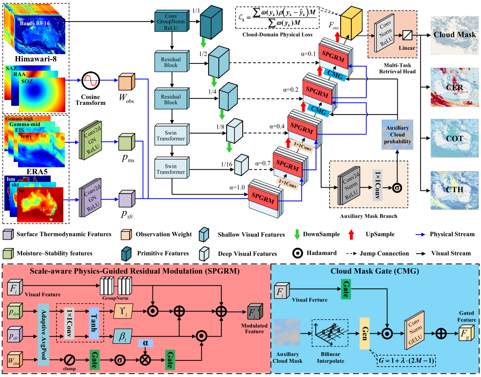

# Scale-aware physics-guided dual-constraint learning for joint cloud property retrieval from Himawari-8 and ERA5 

Xiao Wei, Bing Tu∗, Jun Li, Yan He, Chao Liu and Antonio Plaza, "Scale-aware physics-guided dual-constraint learning for joint cloud property retrieval from Himawari-8 and ERA5 ", Atmospheric Research, 2026

> 💡 **Abstract:**  *Precise retrieval of cloud properties from satellite observations is crucial for quantifying the Earth's radiation budget and understanding the hydrological cycle. However, existing cloud property retrieval methods still struggle to ensure physical plausibility in clear-sky regions and to reconcile the scale mismatch between large-scale atmospheric environments and high-resolution satellite radiances. To address these challenges, this study proposes a Scale-aware Physics-guided Dual-Constraint Network (SPDC-Net) for the joint retrieval of cloud mask, cloud top height (CTH), cloud optical thickness (COT), and cloud effective radius (CER) from daytime Himawari-8 observations and ERA5 reanalysis. Specifically, ERA5 atmospheric and surface variables are decomposed into complementary physical representations and progressively injected into multi-scale visual features via scale-aware residual modulation, while a cloud-mask-guided structural constraint explicitly confines continuous-parameter retrievals to physically valid cloudy regions. In addition, we construct an Australian Cloud Retrieval Dataset (AUS-CRD) covering Australia and its surrounding oceans through unified spatiotemporal collocation and physics-consistent preprocessing. Experimental results demonstrate that SPDC-Net outperforms operational Himawari-8 products and existing retrieval methods in joint cloud-property retrieval with improved physical plausibility and spatial structure preservation. Analyses of extreme convective events, seasonal patterns, and land–ocean contrasts, together with independent validation against CALIPSO, further show that SPDC-Net captures the main spatial patterns and statistical characteristics of cloud fields. This work offers new insights into physics-guided learning for satellite remote sensing and highlights the effectiveness of integrating cross-scale physical priors with explicit structural constraints for high-fidelity cloud-property retrieval. The code is available at https://github.com/2001weixiao/SPDC-Net.*

  

**Fig. 1. Overall architecture of the proposed SPDC-Net for joint cloud-property retrieval. The SPGRM progressively injectsERA5-derived physical priors into muli-scale visual features to bridge the cross-scale gap, while the CMG module couples theauxiliary cloud probability with regression features to confine continuous retrievals to physically valid cloudy regions and provide
a mechanism to limit potential spurious clear-sky responses.** 

## Dependencies

Python 3.9

PyTorch 2.5.0 (with CUDA 12.1)

## Datasets

We construct the **Australian Cloud Retrieval Dataset (AUS-CRD)**, a multi-source dataset covering Australia and its surrounding oceans, built by jointly collocating Himawari-8 (AHI) observations, ERA5 reanalysis, and MODIS (Aqua) cloud products through unified spatiotemporal alignment and physics-consistent preprocessing. The dataset provides paired satellite radiances, atmospheric reanalysis fields, and cloud property labels (cloud mask, CTH, COT, CER) for model training and evaluation.

Detailed dataset construction procedures, preprocessing code, and the full data description will be released upon acceptance of the paper.

## Usage
For any questions, feel free to contact us  [weixiao0124@126.com](mailto:weixiao0124@126.com).

## Citation
If you find the code helpful in your research or work, please cite the following paper.
